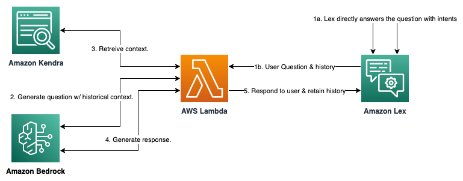
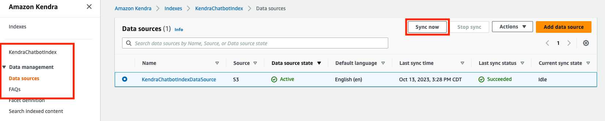
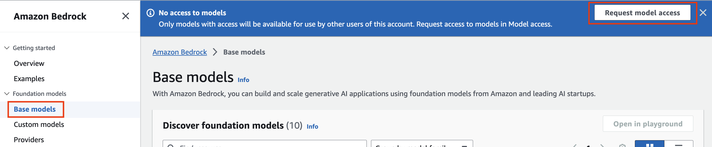
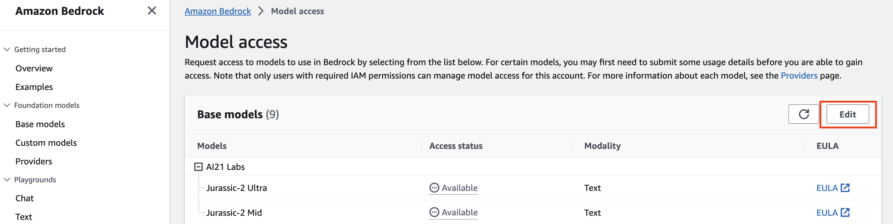
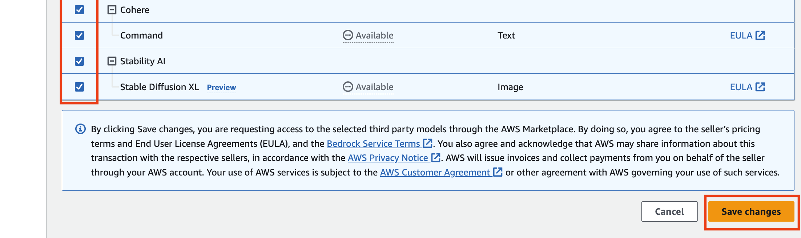
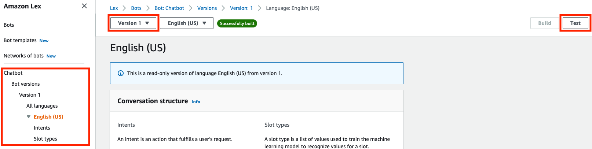

# Build a Chatbot for your documents using Amazon Bedrock, Amazon Lex, and Amazon Kendra

This Retrieval Augmented Generation (RAG) chatbot, written in Python, is designed to answer user prompts against specific documents by harnessing AWS Lambda, Amazon Lex, Amazon Kendra, Langchain, and a Large Language Model (LLM) hosted on Amazon Bedrock. The bot UI is hosted through Amazon Lex, and uses a Lambda invocation via fallback intents to facilitate interactions between a user and the LLM. As our retrieval source we are using Amazon Kendra, as it offers robust Natural Language Processing (NLP) indexing of text data, allowing us to retrieve results based on semantic similarity without having to worry about vector embeddings, chunking strategies, and managing external vector datastores. Data indexed by Kendra can be in various text formats such as PDF, txt, doc, and others, and can be indexed either manually, or with the help of the built in web crawler.

## Solution Overview

In this project, we demonstrate an architectural design that showcases how to build a Generative AI chatbot based on data contained in documents. The solution leverages an AWS Lambda function to orchestrate between Amazon Bedrock, Amazon Kendra, and Amazon Lex. Amazon Bedrock, along with the Amazon Titan model (which can easily be swapped with any other Amazon Bedrock model) provides the Generative AI capabilities. Amazon Kendra is used to search across a set of documents. This allows the solution to find relevant context to the user's questions. Finally, Amazon Lex is used to provide a conversational interface to the user, which includes retention of past user questions. This is critical when it comes to a user asking follow-up questions of the bot.

### Architecture reference (Request Flow)

The following figure shows the basic architecture and information flow.


**Figure 1 – User request flow**

Let’s go through the request flow to understand what happens at each step, as shown in Figure 1:

1. If Lex has an intent to address the question then Lex will handle the response. If Lex can't handle the question then it will be sent to the Lambda function.
2. The Lambda function leverages the ConversationalRetrievalChain to call the Bedrock endpoint to formulate a prompt based on the question and conversation history.
3. The Lambda function sends that prompt to the Kendra retrieve API, which returns a set of context passages.
4. The Lambda function sends the prompt along with the context to the Bedrock endpoint to generate a response.
5. The Lambda sends the response along with message history back to the user via Lex. Lex stores the message history in a session.

**_NOTE:_**  In steps 2 and 4 we use two different LLMs via the Bedrock service. This is an impactful feature of both Bedrock and LangChain that allow customers to make cost/performance decisions on which model to use for various use cases.

## Getting Started

### Prerequisites

For this solution, you need the following prerequisites:

* The [AWS Command Line Interface (CLI)](https://aws.amazon.com/cli/) installed and [configured for use](https://docs.aws.amazon.com/cli/latest/userguide/cli-chap-configure.html).
* The [Docker CLI](https://docs.docker.com/get-docker) installed for building the lambda container image.
* Python 3.9 or later, to package Python code for Lambda
   `Note`: We recommend that you use a [virtual environment](https://docs.python.org/3.9/library/venv.html) or [virtualenvwrapper](https://virtualenvwrapper.readthedocs.io/en/latest/) to isolate the solution from the rest of your Python environment.
* An IAM role or user with sufficient permissions to create an Amazon Kendra Index, invoke Amazon Bedrock, create an IAM Role and Policy, and create a Lambda function.

### Deploy the sample solution

From within the directory where you've downloaded this sample code from GitHub, first run the following command to initialize the environment and create an ECR repository for our Lambda Function's image. Then run the next command to generate the cloudformation stack and deploy the resources.

`Note`: Ensure docker is running prior to running the commands below.

```bash
bash ./helper.sh init-env
 …
{
   "repository": {
      …
   }
}
```

```bash
bash ./helper.sh cf-create-stack
 …
Successfully created CloudFormation stack.
```

### Setup Amazon Kendra

Navigate to the Amazon S3 service in the AWS console. Once there, find the bucket that was created via the CloudFormation template. The bucket name should begin with 'llm-lex-chatbot'. Finally, upload the text documents that you would like to test with this RAG chatbot.

With the documents uploaded, we can now sync the data with Amazon Kendra. Navigate to the Amazon Kendra service in the AWS console. Select 'Indexes' from the menu on the left. Then click on the index that was created from the CloudFormation template. The index name should be 'KendraChatbotIndex'. After the index is selected, navigate to 'Data source' on the left menu bar. Select the data source named 'KendraChatbotIndexDataSource' by clicking the radio button to the left of the item. Once it is selected then click the 'Sync now' button and wait for the sync to complete (depending on the number of documents you've uploaded to S3 this process can take several minutes).



### Setup Model Access in Amazon Bedrock

If this is your first time using Amazon Bedrock in the AWS account you're deploying this bot in, you will first need to request access to Bedrock hosted models. Start by making sure you're in us-east-1 (or the appropriate region if you changed these config parameters for the deployment), and then navigate to the Bedrock console. A welcome prompt will pop up to request model access. If the prompt has already been dismissed you can navigate to the 'Base models' page via the left navigation bar, and then click the 'Request model access' button in the blue banner at the top of the page.



Within the Model access page click the 'Edit' button at the top right, and select the model(s) that you would like access to, or use the select all option at the top left to enable access to all Bedrock models (note that this will not enable models that are still in Preview).  



Once your selections have been made, click the orange 'Save changes' button at the bottom right of the page and proceed to the next step.



### Test via the Amazon Lex interface

At this point we have a fully functioning chatbot. Navigate to the Amazon Lex service in the AWS console to test the functionality. Once there, select the 'Chatbot' bot that the CloudFormation template created. In the menu on the left, select 'English' under 'All languages'. At the top of the screen you will see a 'Version' dropdown. Select 'Version 1' from the dropdown, as the Draft version isn't associated with our Alias and Lambda function. Confirm the Alias of 'ChatbotTestAlias' which is associated with our lambda function. Use the chat interface to test the bot. Remember that this bot leverages retrieval augmented generation and your documents to answer questions. So if you have not uploaded data that is pertinent to the questions you ask (and thus the context in your document retrieval does not answer the question), then the bot will return a response of "I don't know" or similar.

Also, the example includes a Lex intent to reset a password. So try asking a question like, "I forgot my password, can you help?". This intent will be served through Lex without the need to interact with the LLM via the fallback intent. This is useful when you want to serve a fixed set of user intents, independent of using Generative AI.



### Cleanup

When you're done with this bot, first delete all files in the WebDataS3Bucket that was created for this sample. Then you can delete all associated AWS resources via this command:

```bash
bash ./helper.sh cf-delete-stack
 …
```
